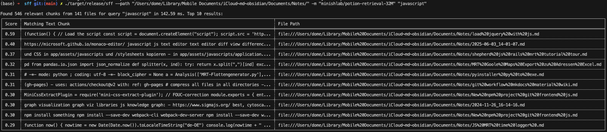

# SemanticFileFinder (sff)

[](https://crates.io/crates/sff)
[](https://opensource.org/licenses/MIT)
[](https://github.com/your_username/sff)

**sff (SemanticFileFinder)** is a command-line tool that rapidly searches for files in a given directory based on the semantic meaning of your query. It leverages sentence embeddings through `model2vec-rs` to understand content, not just keywords. It reads `.txt`, `.md`, and `.mdx` files, chunks their content, and ranks them by similarity to find the most relevant text snippets.

## Installation & Quick Start

### Install from crates.io

You can install `sff` using Cargo:

```bash
cargo install sff
sff "project ideas for rust"
```
Ensure `~/.cargo/bin` is in your system's `PATH`. Default is cwd with `--path .`

### Build from Source

To build and install from source:

```bash
git clone https://github.com/do-me/sff.git
cd sff
cargo build --release
cargo install --path .
```

The binary will be available in `target/release/sff` and installed to `~/.cargo/bin/sff`.

I use this tool myself to scan my personal notes. In the past these were simple .txt files in a folder until I migrated everything to iCloud + Obsidian. Here is some sample output from some random notes:



## Performance 

tl;dr: under 250ms for English-only models on ~2500 files and 10k chunks (with 20 words per chunk) on an M3 Max. If you need the best possible results and good multilingual retrieval, go for `minishlab/potion-multilingual-128M`.
Else, stick to the default with `minishlab/potion-retrieval-32M`. Keep an eye on new model2vec models here: https://huggingface.co/minishlab.

| Command                                                                     | Model                    | Query      | Files | Chunks | Time (ms) |
| --------------------------------------------------------------------------- | ------------------------ | ---------- | ----- | ------ | --------- |
| `sff -m "minishlab/potion-base-8M" "javascript"`           | potion-base-8M           | javascript | 2537  | 10000  | 209.34    |
| `sff -m "minishlab/potion-retrieval-32M" "javascript"`     | potion-retrieval-32M     | javascript | 2537  | 10000  | 249.95    |
| `sff -m "minishlab/potion-multilingual-128M" "javascript"` | potion-multilingual-128M | javascript | 2537  | 10000  | 1001.69   |

## Features

*   **Semantic Search:** Finds files based on meaning, not just exact keyword matches.
*   **Supported Files:** Scans `.txt`, `.md`, and `.mdx` files.
*   **Content Chunking:** Breaks down documents into smaller, manageable chunks for precise matching.
*   **Embedding Powered:** Uses `model2vec-rs` to generate text embeddings. Models are typically downloaded from Hugging Face Hub.
*   **Fast & Parallelized:** Utilizes Rayon for parallel processing of file discovery, embedding generation, and similarity calculation.
*   **Customizable:**
    *   Specify search directory.
    *   Define your semantic query.
    *   Choose the embedding model (Hugging Face Hub or local path).
    *   Limit the number of results.
    *   Enable recursive search through subdirectories.
*   **Verbose Mode:** Offers detailed timing information for performance analysis.
*   **Clickable File Paths with Line Numbers:** Output paths are formatted for easy opening in most terminals & VS Code with line numbers!

## Usage

The basic command structure is:

```bash
sff [OPTIONS] <QUERY>...
```

**Examples:**

*   Search in the current directory for "machine learning techniques":
    ```bash
    sff "machine learning techniques"
    ```

*   Search recursively in `~/Documents/notes` for "project ideas for rust":
    ```bash
    sff -p ~/Documents/notes -r "project ideas for rust"
    ```

*   Use a different model and limit results to 5:
    ```bash
    sff -m "minishlab/potion-multilingual-128M" -l 5 "benefits of parallel computing"
    ```

*   Format as JSON:
    ```bash
    sff "javascript" --json
    ```

**All Options:**

You can view all available options with `sff --help`:

```
sff: Fast semantic file finder

Usage: sff [OPTIONS] <QUERY>...

Arguments:
  <QUERY>...
          The semantic search query

Options:
  -p, --path <PATH>
          The directory to search in
          [default: .]

  -m, --model <MODEL>
          Model to use for embeddings, from Hugging Face Hub or local path
          [default: minishlab/potion-retrieval-32M]

  -l, --limit <LIMIT>
          Number of top results to display
          [default: 10]

  -r, --recursive
          Search recursively through all subdirectories

  -v, --verbose
          Enable verbose mode to print detailed timings for nerds

  -h, --help
          Print help (see more with '--help')

  -V, --version
          Print version

  --json
          Instead of table return JSON formatted output
          
  -e, --extension <EXTENSION>
          Choose file extension to target,
          or multiple extensions delimited with "," (e.g. "-e md,org"), 
          or with separate arguments (e.g. "-e md -e org") 
          [default: txt md mdx org]

```

## Models

`sff` uses `model2vec-rs`, which typically downloads models from the [Hugging Face Hub](https://huggingface.co/models). The default model is `minishlab/potion-retrieval-32M`. You can specify any compatible sentence transformer model available on the Hub or a local path to a model. The first time you use a new model, it will be downloaded, which might take some time.

## Roadmap 

### Missing Args 
- batch size - currently 128 texts of 20 words each are inferenced at the same time

### Chunker Options
- For now, add more arguments like number of words for chunking
- In the long run, add https://github.com/benbrandt/text-splitter as chunker and allow the user to customize chunking

### Output Options
- Add multiple export options for the output table like JSON, CSV, Parquet and markdown (for potential LLM-pipelines). Possibly I'd just add polars or similar as dependency and use their exporter https://docs.pola.rs/api/python/dev/reference/io.html

PR's always welcome!

## FAQ 

### MacOS: Search folders in iCloud
If you want to search any folder on iCloud (e.g. your Obsidian vault) you need to grant full disk access to your shell, e.g. iTerm2 in the system settings:


Reopen the shell and the problem should be fixed.

## License

* MIT

## Dev Notes 

### Versioning
This repo is following [semantic versioning](https://semver.org/) in this format MAJOR.MINOR.PATCH, where MAJOR includes breaking changes, MINOR means backward-compatible changes/features and PATCH is just used for bug fixes. Most of the releases you see here should be MINOR so you can simply update this sff crate from time to time to see what's new.

### Publishing

How to publish a new release on crates.io (mainly notes to myself):

1. Check that any new feature is documented properly in the readme
2. Update version number in `cli.rs` & `Cargo.toml`
3. Commit these changes as preparation for new release: `git add .`, `git commit -m "Prepare for version MAJOR.MINOR.PATCH"`, `git push`
4. `cargo publish`
5. Tag the release properly `git tag vMAJOR.MINOR.PATCH`, `git push origin vMAJOR.MINOR.PATCH`

---
Built by Dominik Weckmüller. If you like semantic search, check out my other work on [GitHub](https://github.com/do-me) e.g. [SemanticFinder](https://github.com/do-me/SemanticFinder)!
